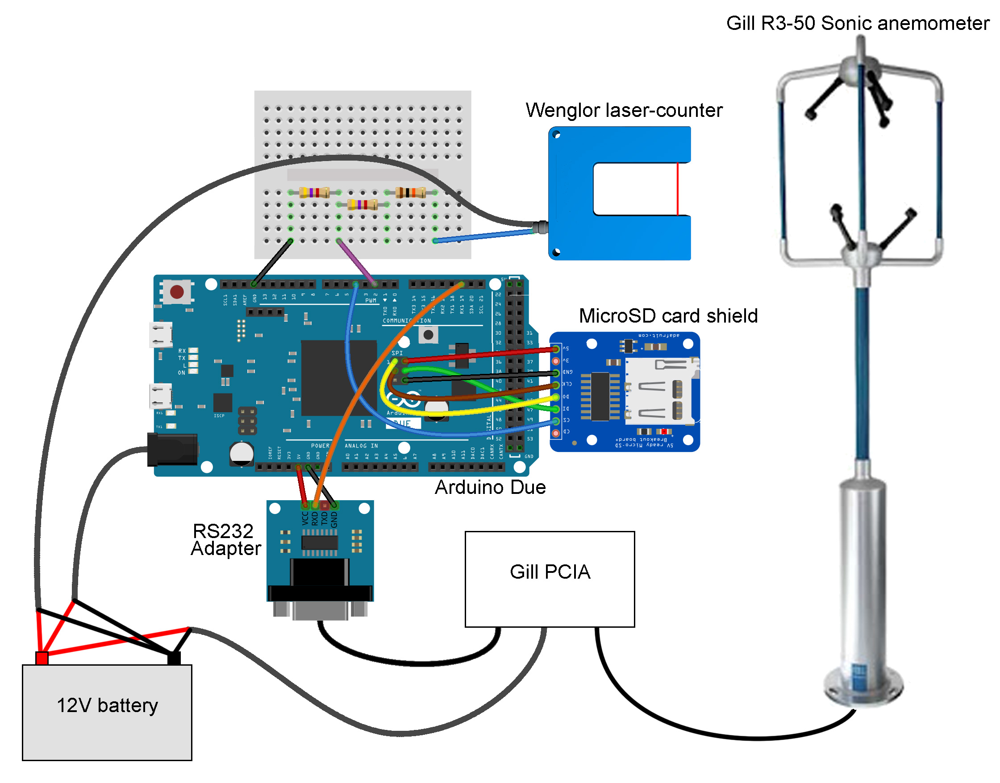

[![CC BY 4.0][cc-by-shield]][cc-by]

# Aeolean Sediment Measurer
Open-source hardware design for High-frequency measurement of wind-blown sand.

# Instructions
1. Ensure you have read and understand the disclaimer and license associated with this guide.
2. Acquire the necessary parts listed in the [Bill of Materials](https://docs.google.com/spreadsheets/d/1BAKtbqieHCemCTPPsL36uj2QXcKh0NGoTecxeYXc90M)
3. Assemble the circuitry following the hookup schematic below or included in this folder (SonicandWenglor.jpg).
4. Upload the sketch to the Arduino Duo.

# Hook-up schematic (made with Fritzing):

# License
This work is licensed under a [Creative Commons Attribution 4.0 International
License][cc-by] - any use of any material here requires attribution.

### Citation Information:
Chan, K., Schillereff, D., Baas, A., Chadwick, M., Main, B., Mulligan, M., O'Shea, F., Pearce, R., Smith, T.E., van Soesbergen, A., Tebbs, E. and Thompson, J., 2019. Low-cost electronic sensors for environmental research: pitfalls and opportunities. **DOI: To follow**

[![CC BY 4.0][cc-by-image]][cc-by]

[cc-by]: http://creativecommons.org/licenses/by/4.0/
[cc-by-image]: https://i.creativecommons.org/l/by/4.0/88x31.png
[cc-by-shield]: https://img.shields.io/badge/License-CC%20BY%204.0-lightgrey.svg
