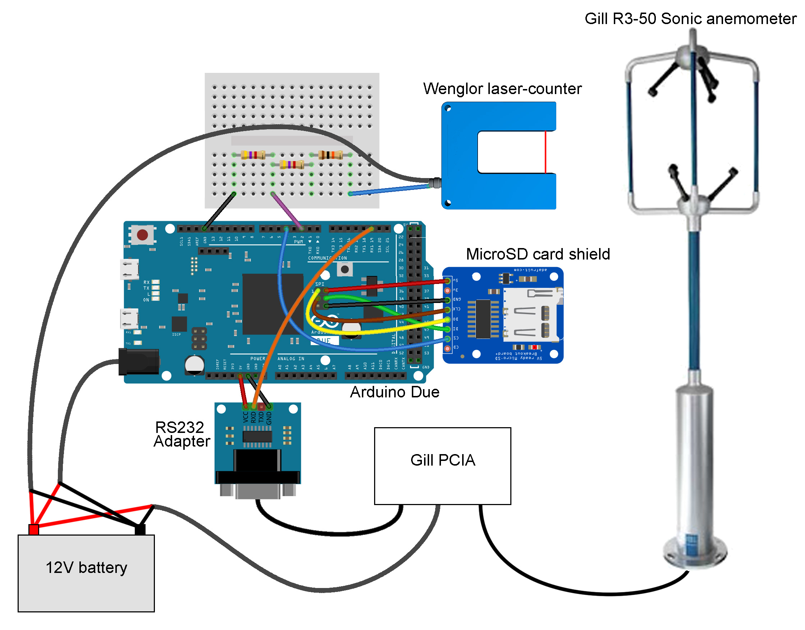

[![CC BY 4.0][cc-by-shield]][cc-by]

# Aeolean Sediment Measurer
Open-source hardware design for High-frequency measurement of wind-blown sand.

# Instructions
1. Ensure you have read and understand the disclaimer and license associated with this guide.
2. Acquire the necessary parts listed in the [Bill of Materials](https://docs.google.com/spreadsheets/d/1BAKtbqieHCemCTPPsL36uj2QXcKh0NGoTecxeYXc90M/edit#gid=590094508).
3. Assemble the circuitry following the hookup schematic below or included in this folder [SonicandWenglor.jpg](SonicandWenglor.jpg).
4. Upload the sketch to the Arduino Duo.

### Hook-up schematic (made with Fritzing):

### Disclaimer: 
The material in this repository is intended as documentation of the process by which the King's College London environmental monitoring team build our open-source loggers. Though we take care to ensure that the pages are accurate as of the date of publication, Arduino software, libraries, electronic components and interface devices are all subject to variation, change with time, and all introduce the potential for risk. The authors take no responsibility for the consequences of error or for any loss, damage or injury suffered by users or their property as a result of any of the information published on any of these pages, and such information does not form any basis of a contract with readers or users of it. The audience should verify any information provided and only proceed if they have an adequate understanding of electronics and electronics safety.

# License
This work is licensed under a [Creative Commons Attribution 4.0 International
License][cc-by] - any use of any material here requires attribution.

### Citation Information:
Chan, K., Schillereff, D., Baas, A., Chadwick, M., Main, B., Mulligan, M., O'Shea, F., Pearce, R., Smith, T.E., van Soesbergen, A., Tebbs, E. and Thompson, J., 2021. Low-cost electronic sensors for environmental research: pitfalls and opportunities. <em>Progress in Physical Geography: Earth and Environment</em> 45(3): 305-338. **[DOI:10.1177/0309133320956567](https://doi.org/10.1177/0309133320956567)**

[![CC BY 4.0][cc-by-image]][cc-by]

[cc-by]: http://creativecommons.org/licenses/by/4.0/
[cc-by-image]: https://i.creativecommons.org/l/by/4.0/88x31.png
[cc-by-shield]: https://img.shields.io/badge/License-CC%20BY%204.0-lightgrey.svg
