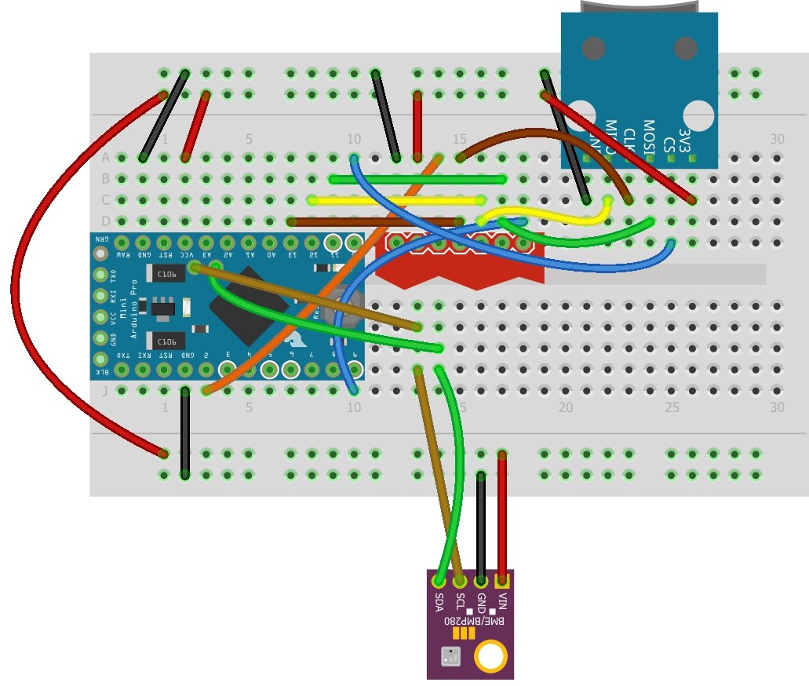
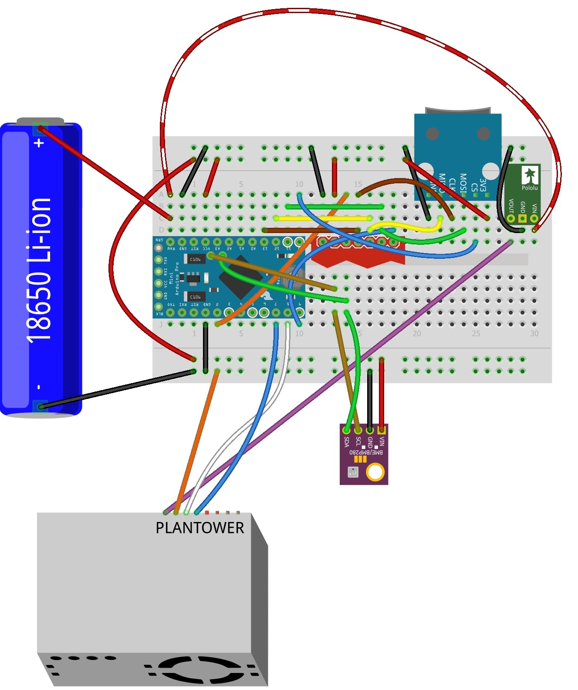
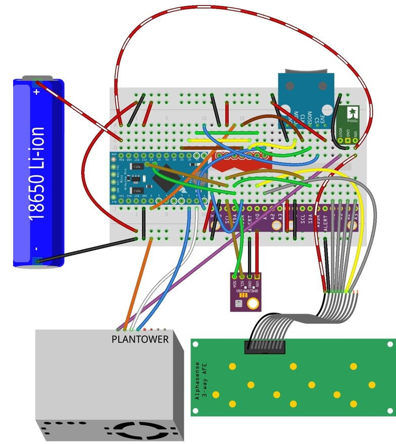

[![CC BY 4.0][cc-by-shield]][cc-by]

# Air Quality Logger
Open-source hardware design for air quality logger measuring particulate matter (PM10, PM2.5, PM1), chemical air quality (NO2, NO, O3) and temperature, relative humidity and barometric pressure.

## Instructions:
1. Read and confirm the declaration and license associated with these instructions.
2. Ensure you have purchased all the necessary parts listed in the [Bill of Materials sheet](https://docs.google.com/spreadsheets/d/1BAKtbqieHCemCTPPsL36uj2QXcKh0NGoTecxeYXc90M/edit#gid=558654440).
3. Start by following the instructions to build and test the [Basic core logger page](https://github.com/KCLGeography/environmental-monitoring/tree/master/basic-logger).

### Adding the BME280
4. Add the BME280 following the assembly diagram below or included in this folder: [BME280.jpg](BME280.jpg).
5. Follow the instructions under 'Install Adafruit_BME280 library' [here] (https://learn.adafruit.com/adafruit-bme280-humidity-barometric-pressure-temperature-sensor-breakout/arduino-test#install-adafruit-bme280-library-2958101-7) to test the BME280, ensuring you have the board set to "Arduino Pro or Pro Mini", processor set to "ATmega328P (3.3V, 8MHz)" and port which you have connected your programmer to (both under the Tools menu). **Note** should the device not work, your BME280 may be on a non-standard address (i.e. not 0x77). You can check it's address by uploading and running [the i2c scanner] (https://playground.arduino.cc/Main/I2cScanner/). Should the address not be the standard, you can change this within the Adafruit BME280 library files (within .../My Documents/Arduino/libraries/Adafruit_BME280_Library/Adafruit_BME280.h)
6. If working, move to the next section.

### Adding the PM sensor
7. Add the Pololu step-up voltage regulator and the PMS-5003 following the assembly diagram below or included in this folder: [Plantower.jpg](Plantower.jpg).
8. Upload the [Only_PM.ino](Only_PM.ino) sketch to the Pro Mini and check the serial monitor (results should be displayed and written to the microSD card every minute).
9. The sensor is now a functioning PM logger.

### Adding the Alphasense chemical air quality sensors
10.  Add the ADS1115 ADCs and the Alphasense Analogue Front End following the assembly diagram below or included in this folder: [Air-quality-diagram.jpg](Air-quality-diagram.jpg). Note: we include a [labelled version without wires](AirQuality-NoWires-Labelled.jpg) should you have trouble identifying parts or pin locations.
11. Upload the [NOx_PM.ino](NOx_PM.ino) sketch to the Pro Mini and check the serial monitor (results should be displayed and written to the microSD card every minute).
12. Set the appropriate sleep times and a suitable filename for your data. Remember to check before deployment.

### Disclaimer: 
The material in this repository is intended as documentation of the process by which the King's College London environmental monitoring team build our open-source loggers. Though we take care to ensure that the pages are accurate as of the date of publication, Arduino software, libraries, electronic components and interface devices are all subject to variation, change with time, and all introduce the potential for risk. The authors take no responsibility for the consequences of error or for any loss, damage or injury suffered by users or their property as a result of any of the information published on any of these pages, and such information does not form any basis of a contract with readers or users of it. The audience should verify any information provided and only proceed if they have an adequate understanding of electronics and electronics safety.

# License
This work is licensed under a [Creative Commons Attribution 4.0 International
License][cc-by] - any use of any material here requires attribution.

### Citation Information:
Chan, K., Schillereff, D., Baas, A., Chadwick, M., Main, B., Mulligan, M., O'Shea, F., Pearce, R., Smith, T.E., van Soesbergen, A., Tebbs, E. and Thompson, J., 2020. Low-cost electronic sensors for environmental research: pitfalls and opportunities. <em>Progress in Physical Geography: Earth and Environment</em> 45(3): 305-338. **[DOI:10.1177/0309133320956567](https://doi.org/10.1177/0309133320956567)**

[![CC BY 4.0][cc-by-image]][cc-by]

[cc-by]: http://creativecommons.org/licenses/by/4.0/
[cc-by-image]: https://i.creativecommons.org/l/by/4.0/88x31.png
[cc-by-shield]: https://img.shields.io/badge/License-CC%20BY%204.0-lightgrey.svg
