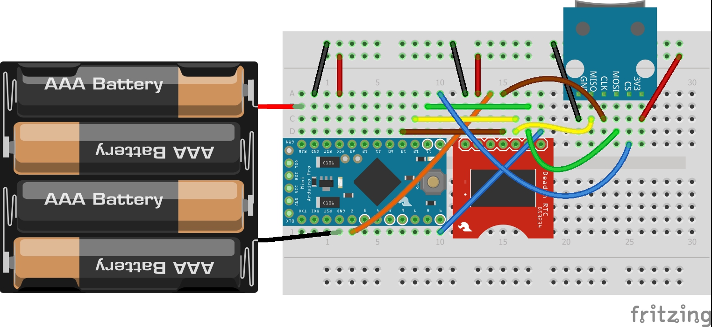
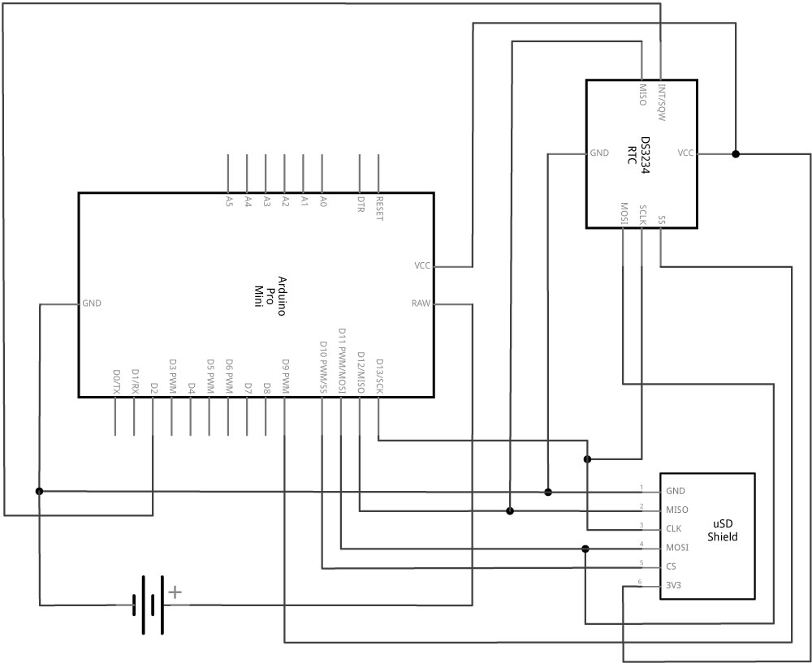

[![CC BY 4.0][cc-by-shield]][cc-by]

## Instructions
1. Read and confirm the disclaimer (bottom of this page) and CC-BY license usage (main repository).
2. Source the material listed in the [Bill-Of-Materials document](https://docs.google.com/spreadsheets/d/1BAKtbqieHCemCTPPsL36uj2QXcKh0NGoTecxeYXc90M).
3. Connect the logger as shown in the breadboard connection diagram (basic-logger-breadboard.jpg file or shown below). Take care to ensure you connect the battery terminals correctly and make sure you do not leave loose wires trailing (with the potential for short-circuiting).
4. Remove the battery pack from the circuit whenever plugging the Arduino into your computer (taking the necessary precautions).
5. Ensure the DS3234 clock has the correct battery in the correct way around.
6. Ensure the microSD card holder has a suitable microSD card with a suitable formatting (FAT32 or <2GB FAT16 micro SD).
7. Connect the 3.3V Pro Mini to your computer using a suitable programmer.
8. Set the correct Arduino (3.3V pro mini) and COM port which the device is connected to.
#### Clock setup and testing
9. Download and install the [DS3234 library](https://github.com/rodan/ds3234) to your Arduino IDE.
10. Set the Chip Select value to 9 (i.e. change "const int cs = 10;" to "const int cs = 9;") 
11. Find the rtc_ds3234 example (File>Example>DS3234>rtc_ds3234) sketch and flash it to the Pro Mini.
12. Open the serial monitor and ensure the baud rate is set at '9600 baud' and line ending is set to 'Both NL & CR'). If connected correctly, your clock should be showing an incrementally increasing time every 5 seconds; if it is not, disconnect the programmer from your computer, recheck the wiring and restart the process.
13. In the input window, set the time following the format TssmmhhWDDMMYYYY and hit Enter (E.g. T001122501052020 for 22:11:00 on Friday 1st May 2020).
14. plug your Arduino back into your computer and reopen the Serial monitor (you may need to make sure the correct COM port is set under Tools > Port). Your clock should be maintaining and Serial printing the time without the need for resetting.

#### SD card setup and testing
15. Download and install the [SDFat library](https://github.com/greiman/SdFat) to your Arduino IDE.
16. Find the QuickStart example (File>Example>SdFat>Quickstart) and flash this to the Pro Mini.
17. Open the serial monitor (ensuring settings are '9600 baud' and 'both NL & CR').
18. Type 10 then hit Enter.
19. The Pro Mini should reply with a "Card successfully initialized." message. If not, disconnect the Pro Mini from your computer, recheck the wiring and that the microSD card is formatted correctly and inserted the correct way.

### Pro Mini Temperature Logger sketch
At this point, you have successfully tested the individual components. We can now upload a basic temperature logger sketch, which takes the temperature from the DS3234 RTC (calibrated) and an uncalibrated temperature measurement from the ATMega328p processor and writes them to the microSD card and serial.
1. Download the [basic logger test sketch](BasicLogger.ino) and flash it to your Arduino.
2. Open the Serial Monitor and observe the results.
3. Unplug the Arduino and check the data has been successfully written to the CSV file on the microSD card. Columns will be formatted:
Year, Month, Date, Hour, Minute, ATmega328 temp, DS3234 temp
4. The sketch acts as a skeleton upon which can very quickly be adapted for the measurement and logging of other sensors.

### Basic logger breadboard connection diagram (image made with Fritzing):

  

Note that the wires are coloured with the following colouration:  
Red - +ve power terminal (from battery or VCC/3.3V)  
Black - GND  
Blue - CS/SS  
Green - MOSI  
Yellow - MISO  
Brown - CLK  
Orange - SQW/INT  

### Basic logger breadboard circuit schematics (image made with Fritzing):

### Disclaimer: 
The material in this repository is intended as documentation of the process by which the King's College London environmental monitoring team build our open-source loggers. Though we take care to ensure that the pages are accurate as of the date of publication, Arduino software, libraries, electronic components and interface devices are all subject to variation, change with time, and all introduce the potential for risk. The authors take no responsibility for the consequences of error or for any loss, damage or injury suffered by users or their property as a result of any of the information published on any of these pages, and such information does not form any basis of a contract with readers or users of it. The audience should verify any information provided and only proceed if they have an adequate understanding of electronics and electronics safety.

# License
This work is licensed under a [Creative Commons Attribution 4.0 International
License][cc-by] - any use of any material here requires attribution.

### Citation Information:
Chan, K., Schillereff, D., Baas, A., Chadwick, M., Main, B., Mulligan, M., O'Shea, F., Pearce, R., Smith, T.E., van Soesbergen, A., Tebbs, E. and Thompson, J., 2020. Low-cost electronic sensors for environmental research: pitfalls and opportunities. <em>Progress in Physical Geography: Earth and Environment</em> 45(3): 305-338. **[DOI:10.1177/0309133320956567](https://doi.org/10.1177/0309133320956567)**

[![CC BY 4.0][cc-by-image]][cc-by]

[cc-by]: http://creativecommons.org/licenses/by/4.0/
[cc-by-image]: https://i.creativecommons.org/l/by/4.0/88x31.png
[cc-by-shield]: https://img.shields.io/badge/License-CC%20BY%204.0-lightgrey.svg
