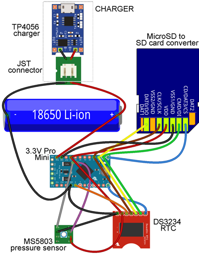
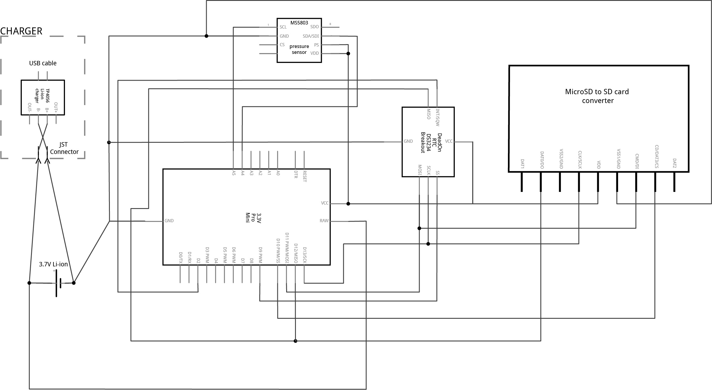

[![CC BY 4.0][cc-by-shield]][cc-by]

# Depth Probe Logger
Open-source hardware design for Water table depth probe logger.

# Instructions
1. Ensure you have read and understand the disclaimer and license associated with this guide.
2. Acquire the necessary parts listed in the [Bill of Materials](https://docs.google.com/spreadsheets/d/1BAKtbqieHCemCTPPsL36uj2QXcKh0NGoTecxeYXc90M/edit#gid=1699271503).
3. With the exception of the Li-ion battery, assemble the circuitry following the hookup schematic below or included in this folder [Depth-probe.png](Depth-probe.png) and [Depth-probe-schematic.jpg](Depth-probe-schematic.jpg). 
4. Taking take to ensure you are connecting the programmer correctly. Follow the steps to set/test the DS3234 clock and microSD card module from the [Basic core logger page](https://github.com/KCLGeography/environmental-monitoring/tree/master/basic-logger).
5. If successful, download and install [Luke Miller's MS5803 (2-bar) library](http://github.com/millerlp/MS5803_02).
6. Upload the [Depth-logger.ino](Depth-logger.ino) sketch to the 3.3V Pro Mini and check that the MS5803 is outputting expected results.
7. Drill a 6.5mm hole in the end-cap of the enclosure. Clean after drilling.
8. Cut a 4cm length of the hose and slide it around the round metal casing of the MS5803.
9. Begin pushing the open end of the hose through the hole in the end-cap so that ~1cm is protuding through the end.
10. Apply epoxy resin inside the end-cap.
11. Push the MS5803 and hose to the end of the end-cap. Apply epoxy generously to the rear of the MS5803 (this is what will hold the MS5803 in place against the water pressure!).
12. Let the epoxy set then retest to make sure the setup is still working.
13. **Li-ion batteries are potentially dangerous. If you do not have the skills, qualifications or experience to conduct the next step, we would advise seeking assistance from those who do.** Solder or spot-weld the 18650 battery to the setup.
14. Connect the TP4056 charger and charge the Li-ion battery. Disconnect once fully charged.
15. If successful, gently position the logger components into the tubing.
16. Apply plumbing tape to the threads and close the enclosure. Test against a reliable depth logger or against known depths to check for accuracy.

### Hook-up diagram (made with Fritzing):

### Circuit schematic (made with Fritzing):

### Disclaimer: 
The material in this repository is intended as documentation of the process by which the King's College London environmental monitoring team build our open-source loggers. Though we take care to ensure that the pages are accurate as of the date of publication, Arduino software, libraries, electronic components and interface devices are all subject to variation, change with time, and all introduce the potential for risk. The authors take no responsibility for the consequences of error or for any loss, damage or injury suffered by users or their property as a result of any of the information published on any of these pages, and such information does not form any basis of a contract with readers or users of it. The audience should verify any information provided and only proceed if they have an adequate understanding of electronics and electronics safety.

# License
This work is licensed under a [Creative Commons Attribution 4.0 International
License][cc-by] - any use of any material here requires attribution.

### Citation Information:
Chan, K., Schillereff, D., Baas, A., Chadwick, M., Main, B., Mulligan, M., O'Shea, F., Pearce, R., Smith, T.E., van Soesbergen, A., Tebbs, E. and Thompson, J., 2020. Low-cost electronic sensors for environmental research: pitfalls and opportunities. <em>Progress in Physical Geography: Earth and Environment</em> 45(3): 305-338. **[DOI:10.1177/0309133320956567](https://doi.org/10.1177/0309133320956567)**

[![CC BY 4.0][cc-by-image]][cc-by]

[cc-by]: http://creativecommons.org/licenses/by/4.0/
[cc-by-image]: https://i.creativecommons.org/l/by/4.0/88x31.png
[cc-by-shield]: https://img.shields.io/badge/License-CC%20BY%204.0-lightgrey.svg
