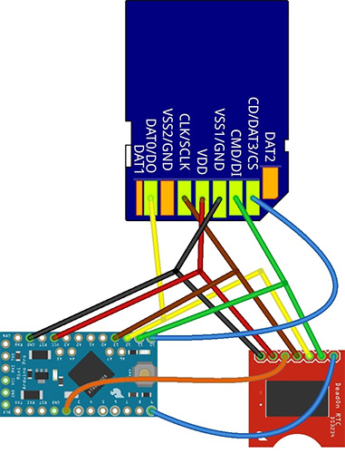
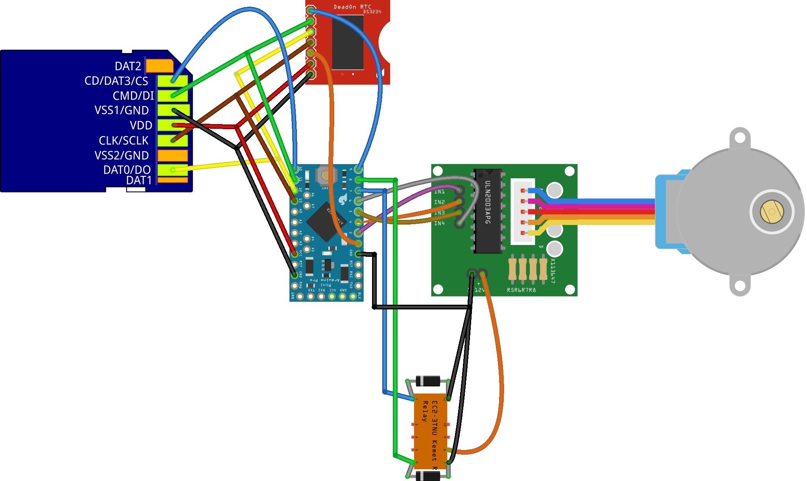
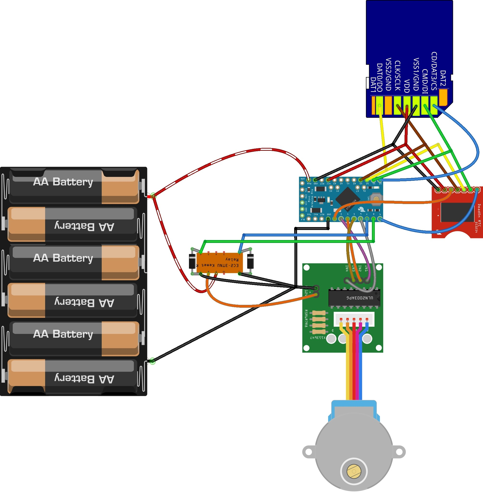

[![CC BY 4.0][cc-by-shield]][cc-by]

# Time-sequencing lake sediment traps
Open-source hardware design for time-sequencing lake sediment traps. in our design, the carousel rotates every month and exposes a new sedement trap, which collects sedement in the water column. 

## Instructions:
1. Read and confirm the declaration and license associated with these instructions.
2. Ensure you have purchased all the necessary parts listed in the [Bill of Materials sheet](https://docs.google.com/spreadsheets/d/1BAKtbqieHCemCTPPsL36uj2QXcKh0NGoTecxeYXc90M/edit#gid=1020050693).
3. In this design, we solder screw terminals to the components for more robust deployment, though direct soldering onto the components would be more secure. You can also adapt the instructions to using a breadboard. Start by assembling the basic logger by assembling the wiring diagram of the basic logger below.
4. Follow the test instructions on the [Basic core logger page](https://github.com/KCLGeography/environmental-monitoring/tree/master/basic-logger) to set and test the clock and microSD card communication.

### Adding the Relay
5. Add the Relay and communication ports for the stepper motor following the assembly diagram below or included in this folder: [LakeSedementRelay.jpg](LakeSedementRelay.jpg).
6. Upload the [LakeSedementTrap sketch](LakeSedementTrap.ino).
7. The stepper motor should rotate and the relay should click on/off. Though we could run the stepper without direct powering (i.e. without the need for the relay), it is more stable to run with this.

### Connecting the power pack
8. Connect the battery pack (6xAA recommended for annual deployment) following the wiring diagram below and test that the circuit still works.

### Assembling the hardware
9. Cut the filter such that it fits into the 4" pipe snugly.
10. Cut the pipe to lengths of ~1m.
11. Using epoxy, glue the pipe and filter onto the cover of the lake sedement trap.

. Test that the circuit still works, before commenting out the minutely test code section in the set alarm subroutine and commenting in the deployment code.

### Disclaimer: 
The material in this repository is intended as documentation of the process by which the King's College London environmental monitoring team build our open-source loggers. Though we take care to ensure that the pages are accurate as of the date of publication, Arduino software, libraries, electronic components and interface devices are all subject to variation, change with time, and all introduce the potential for risk. The authors take no responsibility for the consequences of error or for any loss, damage or injury suffered by users or their property as a result of any of the information published on any of these pages, and such information does not form any basis of a contract with readers or users of it. The audience should verify any information provided and only proceed if they have an adequate understanding of electronics and electronics safety.

# License
This work is licensed under a [Creative Commons Attribution 4.0 International
License][cc-by] - any use of any material here requires attribution.

### Citation Information:
Chan, K., Schillereff, D., Baas, A., Chadwick, M., Main, B., Mulligan, M., O'Shea, F., Pearce, R., Smith, T.E., van Soesbergen, A., Tebbs, E. and Thompson, J., 2019. Low-cost electronic sensors for environmental research: pitfalls and opportunities. **DOI: To follow**

[![CC BY 4.0][cc-by-image]][cc-by]

[cc-by]: http://creativecommons.org/licenses/by/4.0/
[cc-by-image]: https://i.creativecommons.org/l/by/4.0/88x31.png
[cc-by-shield]: https://img.shields.io/badge/License-CC%20BY%204.0-lightgrey.svg
