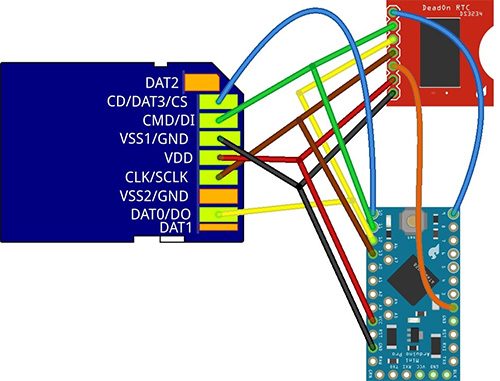
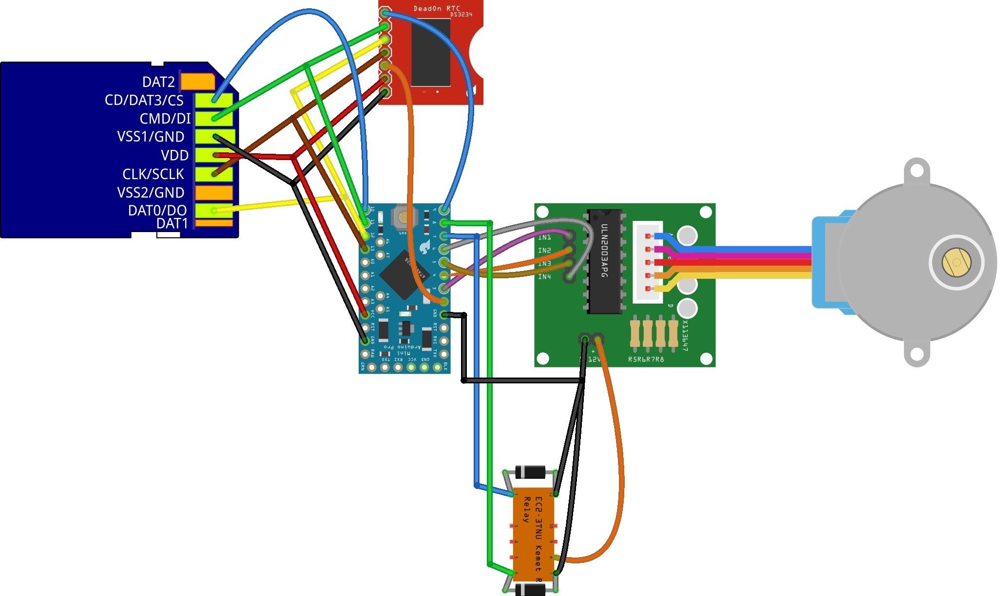
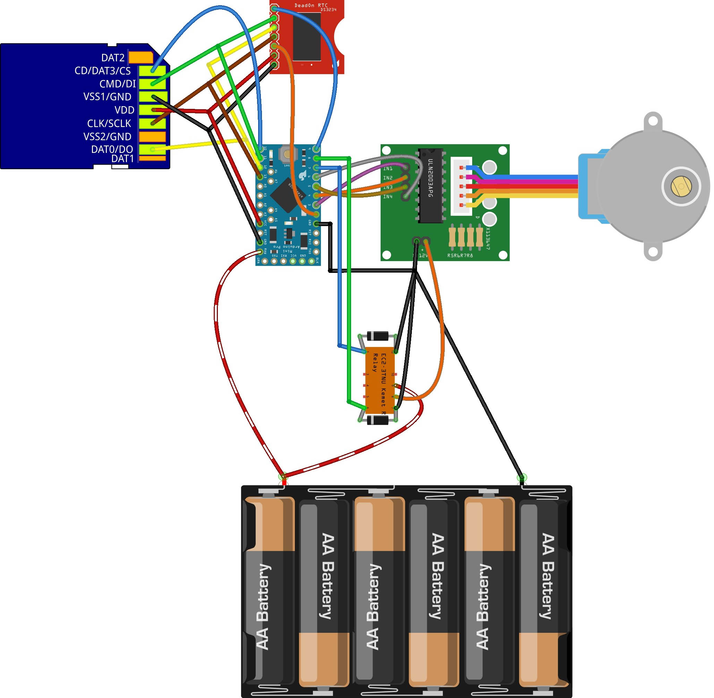

[![CC BY 4.0][cc-by-shield]][cc-by]

# Time-sequencing lake sediment traps
Open-source hardware design for time-sequencing lake sediment traps. in our design, the carousel rotates every month and exposes a new sediment trap, which collects sediment in the water column. 

## Instructions:
1. Read and confirm the declaration and license associated with these instructions.
2. Ensure you have purchased all the necessary parts listed in the [Bill of Materials sheet](https://docs.google.com/spreadsheets/d/1BAKtbqieHCemCTPPsL36uj2QXcKh0NGoTecxeYXc90M/edit#gid=1020050693).
3. In this design, we solder screw terminals to the components for more robust deployment, though direct soldering onto the components would be more secure. You can also adapt the instructions to using a breadboard. Start by assembling the basic logger by assembling the wiring diagram of the basic logger below.
4. Follow the test instructions on the [Basic core logger page](https://github.com/KCLGeography/environmental-monitoring/tree/master/basic-logger) to set and test the clock and microSD card communication.

### Adding the Relay
5. Add the Relay and communication ports for the stepper motor following the assembly diagram below or included in this folder: [LakeSedimentRelay.jpg](LakeSedimentRelay.jpg).
6. Upload the [LakeSedimentTrap sketch](LakeSedimentTrap.ino).
7. The stepper motor should rotate and the relay should click on/off. Though we could run the stepper without direct powering (i.e. without the need for the relay), it is more stable to run with this.

### Connecting the power pack
8. Connect the battery pack (6xAA recommended for annual deployment) following the wiring diagram below and test that the circuit still works.

## Assembling the hardware
Disconnect a battery whilst the below is prepared.

### Preparing the enclosure
9. Drill a 13mm hole in the center of a quadrant of the bottom of the enclosure. This is for the the cable gland and where the axle will pass through. Ensure that burrs on the edges are removed.
10. Check the fitting of the stepper, stepper mechanism and axle. If they fit together well, epoxy these together.
11. Mount the cable gland to the bottom of the enclosure and position the stepper motor in the correct position over the cable gland. Using epoxy, glue the mounting brackets for the stepper motor to the base of the enclosure. Also glue the enclosure to the top of the sediment trap cover.

### Preparing the carousel
12. Drill holes in the tops of 12 of the sampling bottles, being careful to remove and burrs.
13. With epoxy, glue the lids of the sampling bottles into the carousel.

### Preparing the trap top
14. Cut the filter such that it fits into the 4" pipe snugly.
15. Position the foam camping matt against the lake sediment trap top cover and cut around the trap cover. Mark and cut a small hole where the axle and filter will go through the piece - the holes should accommodate the axle and filter bottom snugly. 
16. Epoxy the prepared camping matt to the sediment trap top.
17. Cut the pipe to a length of 75cm.
18. Using epoxy, glue the filter and pipe to the top cover of the lake sediment trap. Wait for this to dry.
19. Put some silicon grease along the section of axle which will rotate within the gland.
20. Push the stepper and axle through the enclosure and mount the stepper motor to the brackets with nuts and bolts. Glue the axle as far through the sediment trap top as it will go whilst still mounted to the stepper in the correct position. The top of the carousel should be snug against the foam.
21. Wait for this to dry then test that it still works.

### Waterproofing
22. Apply silicon grease to the lid of the enclosure for waterproofing. 
23. With the stepper motor disconnected and all components except the stepper absent, close the enclosure and verify the waterproofing of the enclosure in a sink, bathtub or bucket.
24. Test that the circuit still works as expected before commenting out the minutely test code section in the set alarm subroutine and commenting in the deployment code. Flash the deployment version of the software to the Arduino.
25. You may want to melt and pour candle wax into the enclosure to encase the logger components to improve waterproofing if deploying at greater depths (>3m); if opting to do this, ensure you have enough space for the batteries.

### Final preparations
26. Reconnect the stepper, connect the batteries and place all the components inside and close the enclosure.
27. Mount the sediment trap such that the pipe is vertical in the water column. This is best done by zip-tying to structures or buoy lines.

## Disclaimer: 
The material in this repository is intended as documentation of the process by which the King's College London environmental monitoring team build our open-source loggers. Though we take care to ensure that the pages are accurate as of the date of publication, Arduino software, libraries, electronic components and interface devices are all subject to variation, change with time, and all introduce the potential for risk. The authors take no responsibility for the consequences of error or for any loss, damage or injury suffered by users or their property as a result of any of the information published on any of these pages, and such information does not form any basis of a contract with readers or users of it. The audience should verify any information provided and only proceed if they have an adequate understanding of electronics and electronics safety.

# License
This work is licensed under a [Creative Commons Attribution 4.0 International
License][cc-by] - any use of any material here requires attribution.

### Citation Information:
Chan, K., Schillereff, D., Baas, A., Chadwick, M., Main, B., Mulligan, M., O'Shea, F., Pearce, R., Smith, T.E., van Soesbergen, A., Tebbs, E. and Thompson, J., 2019. Low-cost electronic sensors for environmental research: pitfalls and opportunities. **DOI: To follow**

[![CC BY 4.0][cc-by-image]][cc-by]

[cc-by]: http://creativecommons.org/licenses/by/4.0/
[cc-by-image]: https://i.creativecommons.org/l/by/4.0/88x31.png
[cc-by-shield]: https://img.shields.io/badge/License-CC%20BY%204.0-lightgrey.svg
