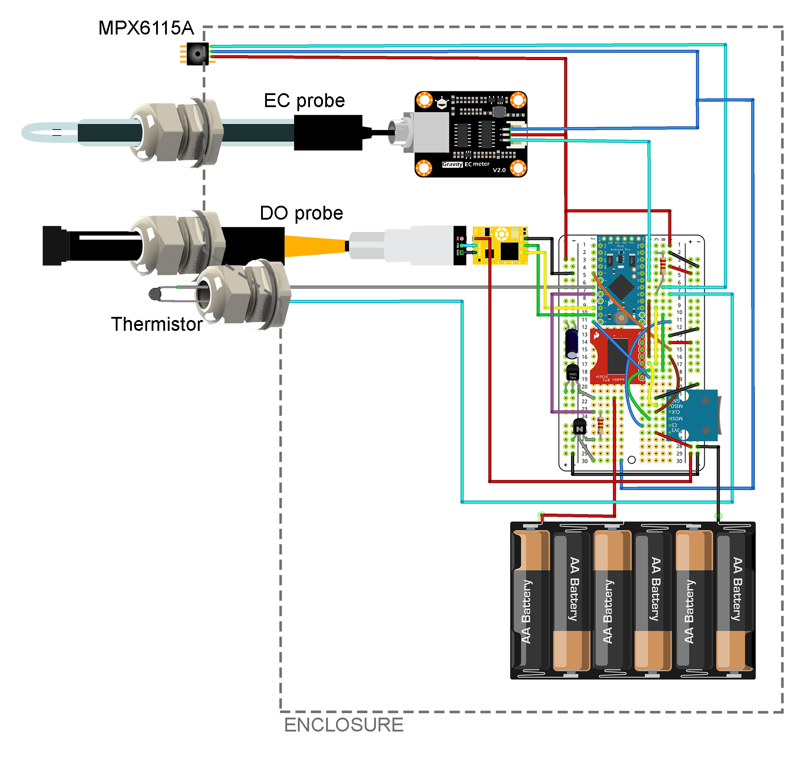

[![CC BY 4.0][cc-by-shield]][cc-by]

# Water Quality Logger
Open-source hardware design for the aquatic water quality logger.

## Instructions:
1. Read and confirm the declaration and license associated with these instructions.
2. Start by following the instructions to build and test the [Basic core logger page](https://github.com/KCLGeography/environmental-monitoring/tree/master/basic-logger).

### Adding the DO probe
3. Connect the wires connecting the Atlas Scientific DO probe (complete wiring diagram below).
4. Download the [example code for the Atlas Scientific DO probe](https://www.atlas-scientific.com/_files/code/ino_files/Arduino_UNO_DO_sample_code.zip).
5. Define rx and tx to be 7 and 8 respectively.
6. Upload the file and open the Serial Monitor.
7. Follow the [instructions here](https://www.instructables.com/id/Atlas-Scientific-EZO-DO-Calibration-Procedure/) to calibrate the DO probe.

### Adding the remaining sensors
8. Connect the remaining sensors, including the 5V supply circuitry.
9. Upload the [WaterQualityLogger.ino sketch](WaterQualityLogger.ino).
10. Wait for the reading to occur (every minute) and check that readings are valid in the serial monitor. Results will be in CSV format of Year, month, day, hour, minute, Conductivity voltage, calibrated conductivity (ms/cm), pressure voltage, calibrated temperature (°C), Dissolved Oxygen reading (mg/L).

### Calibrating the EC probe
11. Download and install the [DFRobot_EC Arduino Library](https://github.com/DFRobot/DFRobot_EC/archive/master.zip) within your Arduino IDE.
12. Upload the [ECProbeCalibration.ino](ECProbeCalibration.ino) sketch and follow the calibration instructions [here](https://wiki.dfrobot.com/Gravity__Analog_Electrical_Conductivity_Sensor___Meter_V2__K%3D1__SKU_DFR0300#target_3) noting that you should be using the amended calibration sketch you have already installed, and changing the Serial baud rate to 9600.

### Preparing the final sketch
13. Back in the [WaterQualityLogger.ino sketch](WaterQualityLogger.ino), set the "sleep_period" to a desirable time and reupload the sketch (note, the maximum period without more significant amendment to the sketch is 59 minutes).
14. Test that the logger is working properly before deploying.  

## Wiring diagram (adapted from Fritzing diagram)

## Disclaimer: 
The material in this repository is intended as documentation of the process by which the King's College London environmental monitoring team build our open-source loggers. Though we take care to ensure that the pages are accurate as of the date of publication, Arduino software, libraries, electronic components and interface devices are all subject to variation, change with time, and all introduce the potential for risk. The authors take no responsibility for the consequences of error or for any loss, damage or injury suffered by users or their property as a result of any of the information published on any of these pages, and such information does not form any basis of a contract with readers or users of it. The audience should verify any information provided and only proceed if they have an adequate understanding of electronics and electronics safety.

# License
This work is licensed under a [Creative Commons Attribution 4.0 International
License][cc-by] - any use of any material here requires attribution.

### Citation Information:
Chan, K., Schillereff, D., Baas, A., Chadwick, M., Main, B., Mulligan, M., O'Shea, F., Pearce, R., Smith, T.E., van Soesbergen, A., Tebbs, E. and Thompson, J., 2020. Low-cost electronic sensors for environmental research: pitfalls and opportunities. <em>Progress in Physical Geography: Earth and Environment</em> 45(3): 305-338. **[DOI:10.1177/0309133320956567](https://doi.org/10.1177/0309133320956567)**

[![CC BY 4.0][cc-by-image]][cc-by]

[cc-by]: http://creativecommons.org/licenses/by/4.0/
[cc-by-image]: https://i.creativecommons.org/l/by/4.0/88x31.png
[cc-by-shield]: https://img.shields.io/badge/License-CC%20BY%204.0-lightgrey.svg
